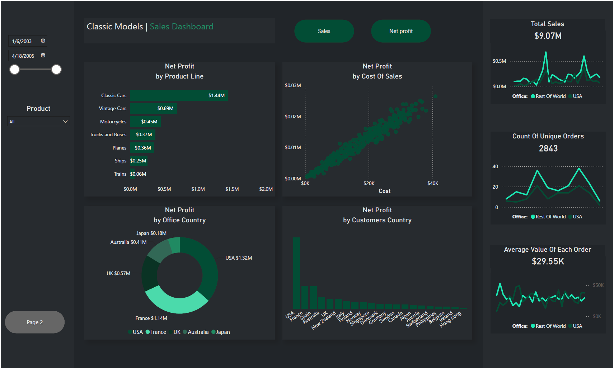
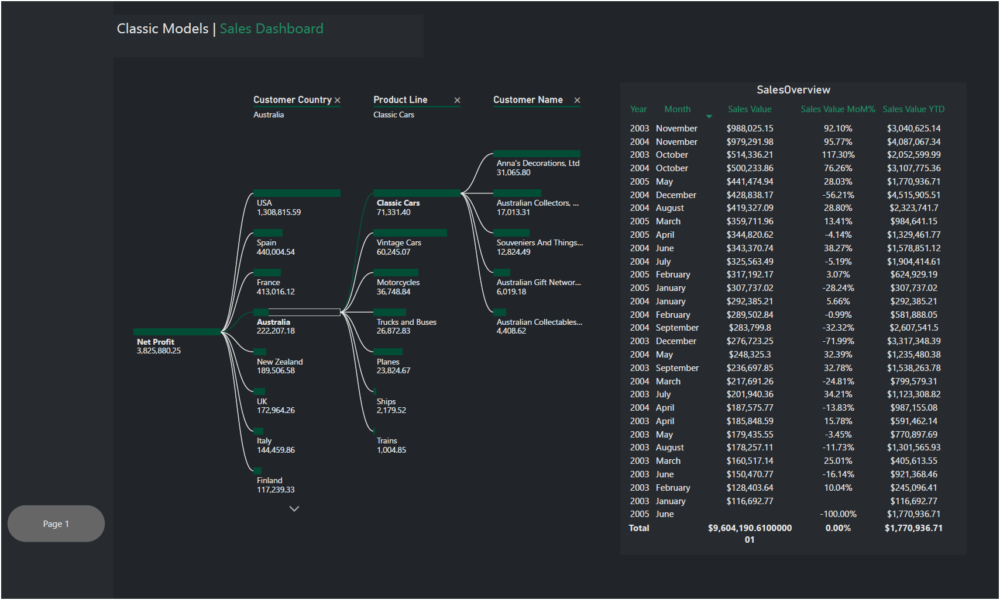

# 📊 Classic Models Sales Analysis Dashboard

An interactive Business Intelligence dashboard built using **MySQL**, **Power BI**, **Power Query**, and **DAX** to analyze sales performance, profitability, customer behavior, and business trends from the Classic Models dataset.

[](https://www.linkedin.com/in/momenhassib/)

---

# 📸 Dashboard Preview



---

# 🚀 Project Overview

This project demonstrates an end-to-end Business Intelligence workflow using the **Classic Models** sales database.

The project includes:

- Extracting and querying sales data using **MySQL**
- Cleaning and transforming data using **Power Query**
- Building a data model in **Power BI**
- Creating dynamic business calculations using **DAX**
- Designing an interactive dashboard to support business decision-making

The dashboard enables users to monitor sales performance, evaluate profitability, analyze customer behavior, identify top-performing product lines, and gain actionable business insights through interactive visualizations.

---

# 🛠️ Tools & Technologies

| Tool | Purpose |
|------|---------|
| MySQL | Data Extraction & Querying |
| Power Query | Data Cleaning & Transformation |
| Power BI | Dashboard Development |
| DAX | Business Calculations & Measures |
| Microsoft Excel | Source Dataset |

---

# 📊 Dashboard Features

- 📅 Interactive Date Filtering
- 📦 Product Filtering
- 💰 Sales & Net Profit Analysis
- 📈 Sales Trend Analysis
- 🌍 Country Performance Analysis
- 👥 Customer Analysis
- 🚚 Product Line Performance
- 🌳 Decomposition Tree Analysis
- 📉 Cost vs Net Profit Analysis
- ⚡ Dynamic DAX Measures

---

# 📈 Key Performance Indicators (KPIs)

- 💰 Total Sales
- 💵 Net Profit
- 📦 Total Orders
- 🛒 Average Order Value
- 📈 Sales Year-to-Date (YTD)
- 📊 Month-over-Month Sales Growth (MoM%)

---

# 📐 DAX Measures

Custom DAX measures created in this project include:

- Net Profit
- Average Sales Value Per Order
- Sales YTD
- Sales MoM%
- Average Sales Value Per Person
- Selected Metric

---

# 📷 Dashboard Pages

## Executive Sales Dashboard


---

## Sales Breakdown & Decomposition Tree



---

# 💡 Business Insights

The dashboard helps answer important business questions, including:

- Which product lines generate the highest profit?
- Which countries contribute the most revenue?
- How do sales trends change over time?
- Which customers generate the highest profit?
- How does cost impact profitability?
- What are the Year-to-Date and Month-over-Month sales trends?

---

# 📂 Repository Structure

```
Classic-Models-Sales-Analysis
│
├── Sales-Overview.png
├── Sales-Breakdown.png
├── Classic-Models-Sales-Dashboard.pbix
├── Classic-Models-Sales-Data.xlsx
└── README.md
```

---

# 🎯 Project Highlights

✔ End-to-End Business Intelligence Project

✔ MySQL Data Extraction

✔ Power Query Data Transformation

✔ Interactive Power BI Dashboard

✔ Advanced DAX Measures

✔ Business Performance Analysis

✔ Executive Sales Reporting

---

# 👨‍💻 Author

## Momen Ahmed Hassib

**Data Analyst**

📍 Giza, Egypt

### 🔗 Connect With Me

[](https://www.linkedin.com/in/momenhassib/)

---

<p align="center">

⭐ If you found this project useful, consider giving it a Star.

Made with ❤️ by <b>Momen Ahmed Hassib</b>

</p>
